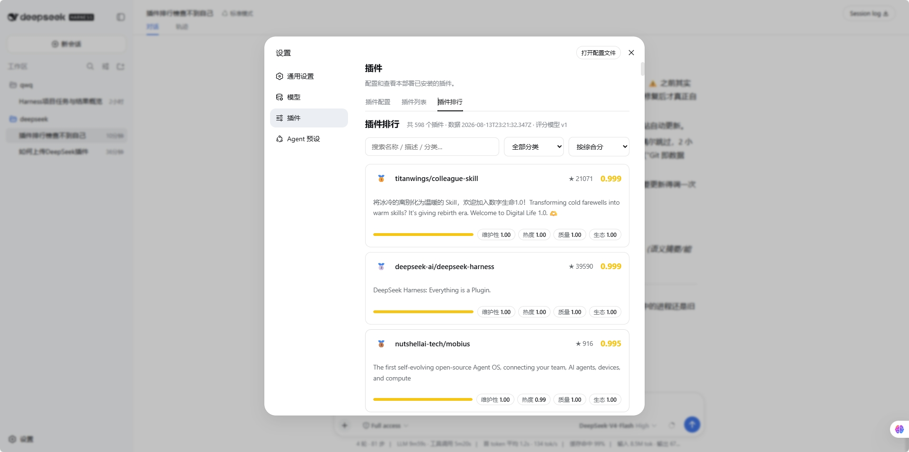
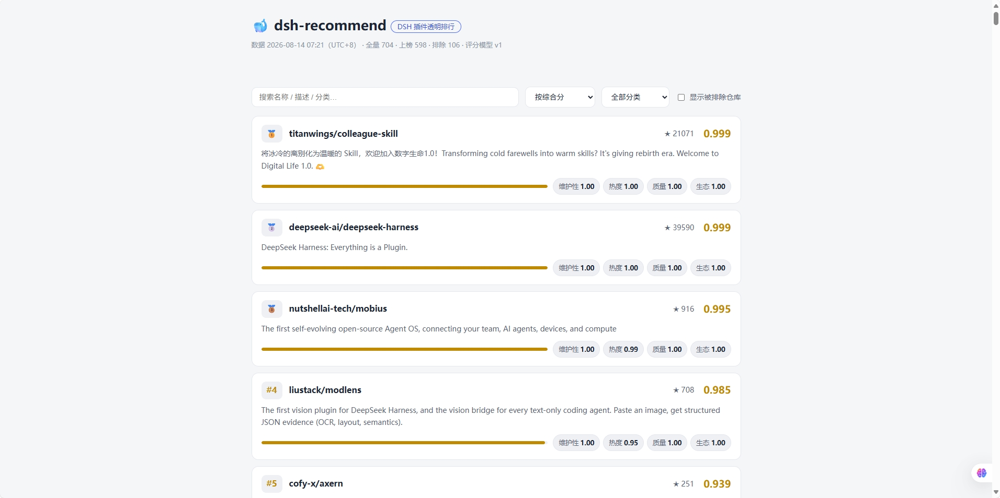

# 🐋 dsh-recommend

> DSH 插件生态的**透明排行与推荐**：每 2 小时自动抓取全 GitHub 的 `dsh-plugin` 话题仓库，按公开的评分模型打分排序；DSH 插件与静态站消费同一份数据。

<p>
  <a href="https://github.com/zp-home/dsh-recommend"></a>
  <a href="LICENSE"></a>
  <a href="https://github.com/zp-home/dsh-recommend/actions/workflows/sync.yml"></a>
  <a href="https://zp-home.github.io/dsh-recommend/site/"></a>
  <a href="https://github.com/topics/dsh-plugin"></a>
  <a href="https://awesome-dsh-plugin.com"></a>
  
</p>

[设计文档](docs/DESIGN.md) · [评分模型](docs/scoring.md) · [路线图](docs/roadmap.md) · [数据](data/rankings.json) · [中文](README.zh.md)

## ✨ 特性

- **透明**：评分公式、权重、全部原始数据都公开在这个仓库里，任何人 `clone` 后跑一遍 `node scripts/sync.mjs` 即可复算——这是排行类项目信任的基石
- **自动化**：GitHub Actions 每 2 小时全量重算并提交 `data/`，数据永不人工维护
- **一份数据，三个消费端**：`data/registry.json` 是唯一事实源，静态排行站、DSH 插件（模型工具 + 设置页标签）、外部工具共用

## 🚀 快速开始

### 1️⃣ 网页版排行（不用安装）

👉 打开 **https://zp-home.github.io/dsh-recommend/site/** —— 卡片式排行榜：前三名奖牌、分数条、四维信号徽章，支持搜索 / 分类筛选 / 四种排序（综合分 / 热度 / 最近更新 / 最新发布）。

**📸 效果预览：**





也可以直接看原始数据：[`data/rankings.json`](data/rankings.json)（每 2 小时自动更新）。

### 2️⃣ 在 DSH 里安装插件（✅ 已真机验证）

**方式 A：npm 安装（国内用户推荐，走 npmmirror 镜像）**

```sh
dsh plugin --profile web add dsh-recommend
# 重启 dsh web 后生效
```

**方式 B：GitHub 直装**

```sh
dsh plugin --profile web add github:zp-home/dsh-recommend
dsh --profile web --dump-config   # 应出现 "# == dsh-recommend" 层
# 重启 dsh web 后生效
```

**方式 C：本地目录安装（完全离线，拷文件夹即可）**

```sh
dsh plugin --profile web add D:\路径\dsh-recommend
```

> 💡 **国内网络提示**：插件榜单数据默认从 `raw.githubusercontent.com` 拉取（`sync_registry` 工具）。无法访问该域名时，可编辑已安装插件包中的 `cordis.patch.yml`（`node_modules/dsh-recommend/cordis.patch.yml`），把 `dsh-recommend` 的 `dataUrl` 改为 `https://cdn.jsdelivr.net/gh/zp-home/dsh-recommend@main/data/registry.json`（jsDelivr CDN，国内一般可达，数据可能有数小时缓存延迟），改后重启 DSH。

安装后获得：

| 面 | 内容 |
|---|---|
| 模型工具 ×4 | `rank_plugins` 榜单查询 · `search_plugins` 检索 · `recommend_plugins` 按目标推荐 · `sync_registry` 刷新本地数据 |
| 设置页标签 | 设置 → 插件 → 「**插件排行**」：完整排行榜，随 DSH 亮/暗主题自动适配 |

> 仓库根目录即插件包（`dsh.bundle` + `dsh.client` 双声明，构建产物 `lib/` 随库提交，git 安装无需构建）。

### 3️⃣ 自己重跑数据管道

```sh
# 需要 Node 18+
node scripts/sync.mjs            # fetch（采集）→ score（过滤+评分）→ validate（门禁）
node scripts/validate.mjs        # 只校验
```

未设置 `GITHUB_TOKEN` 时使用未认证限额（够跑一轮）；CI 中自动注入 token。

## 📊 当前数据

- 全量抓取 **~700** 个 `dsh-plugin` 话题仓库；排除占位/空仓库/WIP 后 **~600** 个上榜
- 评分 = **0.35×维护性 + 0.30×热度 + 0.20×质量 + 0.15×生态**（公式与权重全公开，改版走评审，详见 [docs/scoring.md](docs/scoring.md)）
- 排除条目保留在 `data/registry.json` 并附原因（fork / 已归档 / 空仓库 / 无描述 / 占位特征）

## 📁 仓库结构

```
data/           每 2 小时生成的 registry.json / rankings.json / meta.json（Git 即数据库）
scripts/        fetch（采集）→ score（过滤+评分）→ validate（门禁）→ sync（总入口）
src/            插件源码（host 工具半 + web 数据路由半 + browser 设置页半）
lib/            构建产物（随库提交，git 安装免构建）
cordis.patch.yml 插件配置层（bundle patch）
site/           静态排行站（零构建，直接吃 data/registry.json）
docs/           设计 / 评分模型 / 路线图 / 决策记录
.github/        Actions（每 2 小时 cron + PR 校验）与提交插件表单
```

## 数据源

| 源 | 内容 | 用途 |
|---|---|---|
| GitHub Search API `topic:dsh-plugin` | 全部公开仓库 + stars/更新时间/license/size 等 | 主数据源 |
| [hub 目录公开镜像](https://github.com/0xsline/awesome-deepseek-harness) | 官方精选目录与分类（hub 组织仓库私有，经每日镜像） | 分类映射 + 生态信号 |
| 三个 awesome 列表 | 社区人工精选 | 生态信号 |
| npm registry（规划中） | 下载量 | 真实使用量信号 |

## 🧩 插件架构（简要）

- **三行配置**：`dsh-recommend`（工具半，任何 profile 可用）/ `dsh-recommend/web`（同源数据路由，仅 web profile）/ 浏览器排行标签半（由官方 client-modules 扫描 `dsh.client` 自动供给，无需独立配置行）
- **数据安全**：插件只读 `registry.json` 并展示，从不执行任何被收录插件的代码
- 真机验证记录与踩坑（`window is not defined`、`github:` 安装取根 package.json 等）见 [ADR-0003](docs/decisions/0003-single-package-dual-half.md)

## 开发

```sh
npm install        # 开发依赖（react/typescript/tsdown）
npm run typecheck  # tsc --noEmit
npm run bundle     # tsdown 构建 lib/
npm run sync       # 重跑数据管道
```

## 收录与免责

**收录 ≠ 安全背书。** 本仓库只做只读元数据分析，从不 clone、从不执行被收录插件的代码。安装任何第三方插件前请自行审查源码、权限与许可证。详见 [SECURITY.md](SECURITY.md)。

## 路线图

| 阶段 | 状态 |
|---|---|
| M1 数据管道 + 静态排行站 | ✅ |
| M2 DSH 插件（工具 + 设置页标签） | ✅ 真机验证通过 |
| M3 推荐逻辑升级 + 人工精选层 | 🔨 规划中 |
| M4 生态运营（徽章 / 月度报告 / 安装量遥测） | ⏳ |

## 社区与贡献

- 提交插件收录：[Issue 表单](https://github.com/zp-home/dsh-recommend/issues/new?template=submit-plugin.yml)（或直接打 `dsh-plugin` 话题，每日同步自动收录）
- 贡献指南：[CONTRIBUTING.md](CONTRIBUTING.md)
- 上游生态：[DeepSeek Harness](https://github.com/deepseek-ai/deepseek-harness) · [`dsh-plugin` 话题](https://github.com/topics/dsh-plugin) · [WhaleHub](https://github.com/vvlife/whalehub-dsh)

## License

[MIT](LICENSE)
